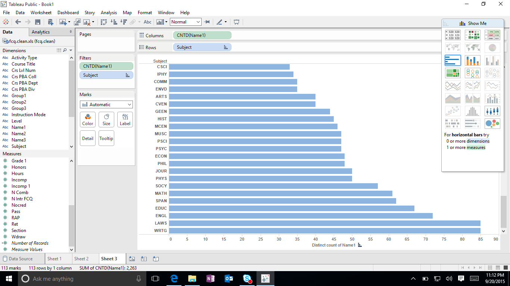
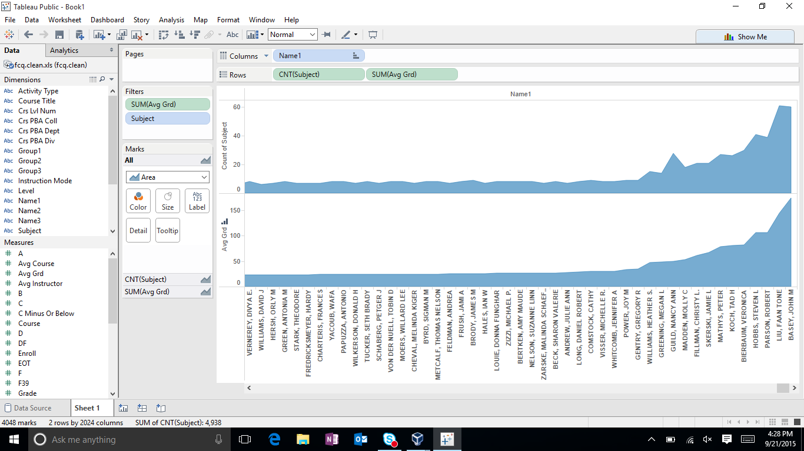
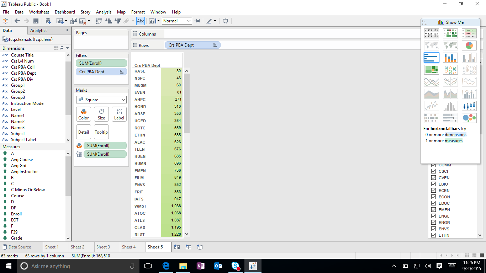
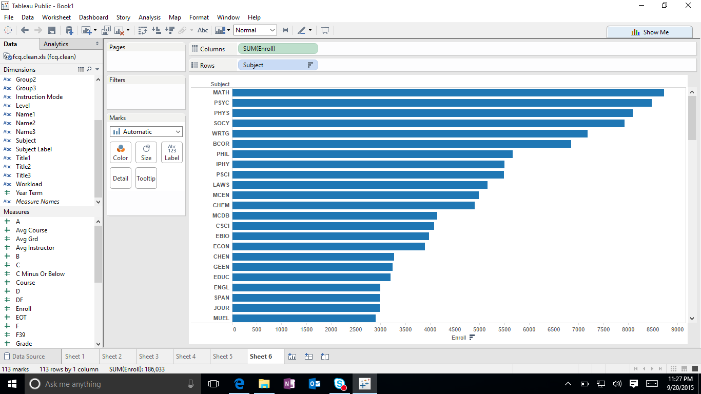
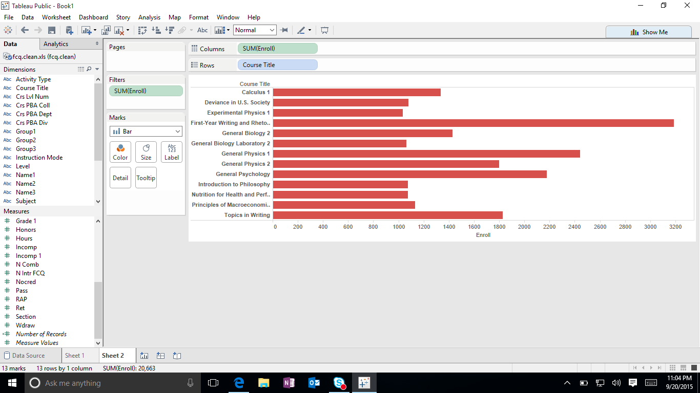

# Visualization

Using Tableau, create visualization for each question in the report. You will
work on this independently just like last week.

To include a Tableau visualization in your report, take a screenshot, save it as an image,
put it in the `learning/week2` folder, and replace ``  with
your own image. Please makes sure your screenshot includes the _entire_ Tableau interface
including the controls, widgets ...etc.

# Import

Data: [fcq.clean.json](https://github.com/bigdatahci2015/book/blob/master/hackathons/fcq/fcq.clean.json)

(a copy of this file is in your book repository already in the directory `hackathons/fcq`)

This dataset is provided to you in the JSON format. Your first task is to figure out
how to transform this JSON file into a format that can be fed into Tableau. As
a junior and senior, you are expected to be able to look around the Internet
to problem solve.

# How many instructors have taught each subject? Kari

At the bottom you can see that WRTG and LAWS have the highest amount of instructors for each subject.

# Does the instruction tends to give out higher grades if they teach more classes? or the reverse? Ming

This was difficult to show so I just put an avg grade and the total of subjects which I think correlated to the instructors avg. grade. 

# Which department has the lowest enrollment? John

As you can clearly see RASE has the lowest enrollment. The chart is ordered from least to greatest.

# Which subject is most in demand,based on the total number of enrollment? Sussant

Math has the highest enrollment. The chart is ordered from greatest to least.

# Which course has the highest enrollment? Andrew

For this one you can see that First year writing has the highest enrollment.
